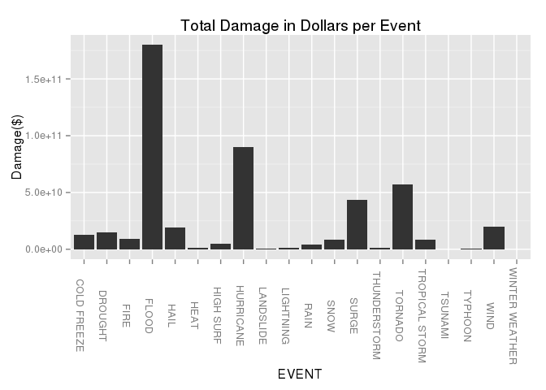
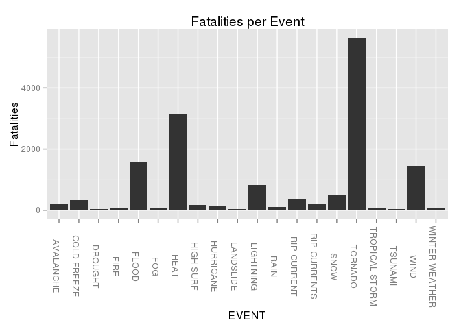

# Reproducible Research: Peer Assessment 2
### Synopsis
This program will look at data from NOAA to find out which events cause the most damage financially and in population health.  To do this the Events were put into more generic categories.  These categories were put together by looking through the data NATIONAL WEATHER SERVICE INSTRUCTION 10-1605.  There are approximately 42 categories, this was used as a baseline but was not stickly followed.  Once the events where combined into top-level events the data is then processed looking at greatest economic consequences(Total Damage Financially) and most harmful to population health(Total Fatalities). 

Tornados are the most most harmful to population health(Fatalities)

Floods have the greatest economic consequences(Total Damage Financially).

## Data Processing
Unzip file and load data in storm dataset.

If the dataset does nto exist on the local file system, the data set will be downloaded from the source. 

```r
if(!file.exists("StormData.csv.bz2")){
  
  download.file("https://d396qusza40orc.cloudfront.net/repdata/data/StormData.csv.bz2", "StormData.csv.bz2", mode = "wb")
  
}
stormdata <- read.csv("StormData.csv.bz2",stringsAsFactors=FALSE)

stormdata["EVENT"] <- stormdata["EVTYPE"]
```

## Data Processing


Create a new dataset for events with the top 20 fatalities

The Event Aggregation happens here because to do it on the large dataset takes to much time with the curren algorithm.  I am sure this could be improved.

```r
fatalitysum <- aggregate(stormdata$FATALITIES, list(EVENT = stormdata$EVENT), FUN = sum)

 injurysum <- aggregate(stormdata$INJURIES, list(EVENT = stormdata$EVENT), FUN = sum)
 
 fatinjsum <- merge(fatalitysum, injurysum, by = "EVENT")
 colnames(fatinjsum) <- c("EventType","Fatalities","Injuries")

fatinjsum["EVENT"] <- fatinjsum["EventType"]

for (i in 1:nrow(fatinjsum)) {
  if(grepl("FOG", fatinjsum[i,'EventType'], ignore.case = TRUE)) {
    fatinjsum[i,'EVENT']= "FOG"
  }
  if(grepl("Surge", fatinjsum[i,'EventType'], ignore.case = TRUE)) {
    fatinjsum[i,'EVENT']= "SURGE"
  }
  if(grepl("WINTER WEATHER", fatinjsum[i,'EventType'], ignore.case = TRUE)) {
    fatinjsum[i,'EVENT']= "WINTER WEATHER"
  }
  if(grepl("LANDSLIDE", fatinjsum[i,'EventType'], ignore.case = TRUE)) {
    fatinjsum[i,'EVENT']= "LANDSLIDE"
  }
  if(grepl("FIRE", fatinjsum[i,'EventType'], ignore.case = TRUE)) {
    fatinjsum[i,'EVENT']= "FIRE"
  }
  if(grepl("TROPICAL", fatinjsum[i,'EventType'], ignore.case = TRUE)) {
    fatinjsum[i,'EVENT']= "TROPICAL STORM"
  }
  if(grepl("TORNADO|TORNDAO", fatinjsum[i,'EventType'], ignore.case = TRUE)) {
    fatinjsum[i,'EVENT']= "TORNADO"
  }
  if(grepl("THUNDERSTORM", fatinjsum[i,'EventType'], ignore.case = TRUE)) {
    fatinjsum[i,'EVENT']= "THUNDERSTORM"
  }
  if(grepl("MUD", fatinjsum[i,'EventType'], ignore.case = TRUE)) {
    fatinjsum[i,'EVENT']= "MUD"
  } 
  if(grepl("LIGHTNING|LIGNTNING|LIGHTING", fatinjsum[i,'EventType'], ignore.case = TRUE)) {
    fatinjsum[i,'EVENT']= "LIGHTNING"
  } 
  
  if(grepl("hurricane", fatinjsum[i,'EventType'], ignore.case = TRUE)) {
    fatinjsum[i,'EVENT']= "HURRICANE"
  } 
  if(grepl("RAIN|WETNESS", fatinjsum[i,'EventType'], ignore.case = TRUE)) {
    fatinjsum[i,'EVENT']= "RAIN"
  } 
  if(grepl("HAIL", fatinjsum[i,'EventType'], ignore.case = TRUE)) {
    fatinjsum[i,'EVENT']= "HAIL"
  }  
  if(grepl("HEAT", fatinjsum[i,'EventType'], ignore.case = TRUE)) {
    fatinjsum[i,'EVENT']= "HEAT"
  }  
  if(grepl("drought|DRY", fatinjsum[i,'EventType'], ignore.case = TRUE)) {
    fatinjsum[i,'EVENT']= "DROUGHT"
  }  
  if(grepl("HIGH WAVES|Beach|Tide|SURF", fatinjsum[i,'EventType'], ignore.case = TRUE)) {
    fatinjsum[i,'EVENT']= "HIGH SURF"
  } 
  if(grepl("cold|Freez|FROST|ICE", fatinjsum[i,'EventType'], ignore.case = TRUE)) {
    fatinjsum[i,'EVENT']= "COLD FREEZE"
  }
  if(grepl("SNOW|Blizzard|WINTER STORM", fatinjsum[i,'EventType'], ignore.case = TRUE)) {
    fatinjsum[i,'EVENT']= "SNOW"
  }
  if(grepl("Flood|HIGH WATER|FLD", fatinjsum[i,'EventType'], ignore.case = TRUE)) {
    fatinjsum[i,'EVENT']= "FLOOD"
  }
  
  if(grepl("WIND", fatinjsum[i,'EventType'], ignore.case = TRUE)) {
    fatinjsum[i,'EVENT']= "WIND"
  }
  
  
  
}
 
newdata2 <- aggregate(fatinjsum$Fatalities, list(EVENT = fatinjsum$EVENT), FUN = sum)

newdata3 <- newdata2[order(newdata2$x, decreasing = TRUE),]
newdata3 <- head(newdata3, n = 20)
```


Analyse Damage Totals

Create New Total Coloumns for Total, Property and Crop in one common $ ammount.

Create a new dataset for events with the top 20 Total Damage

The Event Aggregation happens here because to do it on the large dataset takes to much time with the curren algorithm.  I am sure this could be improved.


```r
stormdata2 <- transform(stormdata, Property= ifelse(grepl("K",PROPDMGEXP, ignore.case = TRUE),PROPDMG * 1000, ifelse(grepl("M",PROPDMGEXP, ignore.case = TRUE),PROPDMG * 1000000,ifelse(grepl("B",PROPDMGEXP, ignore.case = TRUE), PROPDMG * 1000000000, PROPDMG))))

stormdata2 <- transform(stormdata2, Crop= ifelse(grepl("K",CROPDMGEXP, ignore.case = TRUE),CROPDMG * 1000, ifelse(grepl("M",CROPDMGEXP, ignore.case = TRUE),CROPDMG * 1000000,ifelse(grepl("B",CROPDMGEXP, ignore.case = TRUE), CROPDMG * 1000000000, CROPDMG))))

stormdata2 <- transform(stormdata2, TotalDamage = Property + Crop)

propertysum <- aggregate(stormdata2$Property,  list(EVENT = stormdata2$EVENT), FUN = sum)

cropsum <- aggregate(stormdata2$Crop,  list(EVENT = stormdata2$EVENT), FUN = sum)

totalsum <- aggregate(stormdata2$TotalDamage,  list(EVENT = stormdata2$EVENT), FUN = sum)

propcroptotsum <- merge(propertysum, cropsum, by = "EVENT")

propcroptotsum <- merge(propcroptotsum, totalsum, by = "EVENT")

colnames(propcroptotsum) <- c("EventType","ProperyDamage","CropDamage","TotalDamage")

propcroptotsum["EVENT"] <- propcroptotsum["EventType"]

for (i in 1:nrow(propcroptotsum)) {
  if(grepl("FOG", propcroptotsum[i,'EventType'], ignore.case = TRUE)) {
    propcroptotsum[i,'EVENT']= "FOG"
  }
  if(grepl("Surge", propcroptotsum[i,'EventType'], ignore.case = TRUE)) {
    propcroptotsum[i,'EVENT']= "SURGE"
  }
  if(grepl("WINTER WEATHER", propcroptotsum[i,'EventType'], ignore.case = TRUE)) {
    propcroptotsum[i,'EVENT']= "WINTER WEATHER"
  }
  if(grepl("LANDSLIDE", propcroptotsum[i,'EventType'], ignore.case = TRUE)) {
    propcroptotsum[i,'EVENT']= "LANDSLIDE"
  }
  if(grepl("FIRE", propcroptotsum[i,'EventType'], ignore.case = TRUE)) {
    propcroptotsum[i,'EVENT']= "FIRE"
  }
  if(grepl("TROPICAL", propcroptotsum[i,'EventType'], ignore.case = TRUE)) {
    propcroptotsum[i,'EVENT']= "TROPICAL STORM"
  }
  if(grepl("TORNADO|TORNDAO", propcroptotsum[i,'EventType'], ignore.case = TRUE)) {
    propcroptotsum[i,'EVENT']= "TORNADO"
  }
  if(grepl("THUNDERSTORM", propcroptotsum[i,'EventType'], ignore.case = TRUE)) {
    propcroptotsum[i,'EVENT']= "THUNDERSTORM"
  }
  if(grepl("MUD", propcroptotsum[i,'EventType'], ignore.case = TRUE)) {
    propcroptotsum[i,'EVENT']= "MUD"
  } 
  if(grepl("LIGHTNING|LIGNTNING|LIGHTING", propcroptotsum[i,'EventType'], ignore.case = TRUE)) {
    propcroptotsum[i,'EVENT']= "LIGHTNING"
  } 
  
  if(grepl("hurricane", propcroptotsum[i,'EventType'], ignore.case = TRUE)) {
    propcroptotsum[i,'EVENT']= "HURRICANE"
  } 
  if(grepl("RAIN|WETNESS", propcroptotsum[i,'EventType'], ignore.case = TRUE)) {
    propcroptotsum[i,'EVENT']= "RAIN"
  } 
  if(grepl("HAIL", propcroptotsum[i,'EventType'], ignore.case = TRUE)) {
    propcroptotsum[i,'EVENT']= "HAIL"
  }  
  if(grepl("HEAT", propcroptotsum[i,'EventType'], ignore.case = TRUE)) {
    propcroptotsum[i,'EVENT']= "HEAT"
  }  
  if(grepl("drought|DRY", propcroptotsum[i,'EventType'], ignore.case = TRUE)) {
    propcroptotsum[i,'EVENT']= "DROUGHT"
  }  
  if(grepl("HIGH WAVES|Beach|Tide|SURF", propcroptotsum[i,'EventType'], ignore.case = TRUE)) {
    propcroptotsum[i,'EVENT']= "HIGH SURF"
  } 
  if(grepl("cold|Freez|FROST|ICE", propcroptotsum[i,'EventType'], ignore.case = TRUE)) {
    propcroptotsum[i,'EVENT']= "COLD FREEZE"
  }
  if(grepl("SNOW|Blizzard|WINTER STORM", propcroptotsum[i,'EventType'], ignore.case = TRUE)) {
    propcroptotsum[i,'EVENT']= "SNOW"
  }
  if(grepl("Flood|HIGH WATER|FLD", propcroptotsum[i,'EventType'], ignore.case = TRUE)) {
    propcroptotsum[i,'EVENT']= "FLOOD"
  }
  
  if(grepl("WIND", propcroptotsum[i,'EventType'], ignore.case = TRUE)) {
    propcroptotsum[i,'EVENT']= "WIND"
  }
  
}

newdata <- aggregate(propcroptotsum$TotalDamage, list(EVENT = propcroptotsum$EVENT), FUN = sum)

newdata4 <- newdata[order(newdata$x, decreasing = TRUE),]

newdata4 <- head(newdata4, n = 20)
```

## Results

Here are the results for Total Damage

```r
library(ggplot2)
ggplot(data = newdata4,
       aes(EVENT, x)) + ggtitle("Total Damage in Dollars per Event")+ ylab("Damage($)")+
    geom_bar(stat="identity") + theme(axis.text.x=element_text(angle=-90))
```

 

With the top Damage comming from:

```r
colnames(newdata4) <- c("EVENT","Total Damage")
head(newdata4,n =1)
```

```
##    EVENT Total Damage
## 34 FLOOD 179857777781
```
Here are the results for Lives Lost

```r
ggplot(data = newdata3,
       aes(EVENT, x)) + ggtitle("Fatalities per Event")+ ylab("Fatalities")+
    geom_bar(stat="identity") + theme(axis.text.x=element_text(angle=-90))
```

 

The most lives lost are from:

```r
colnames(newdata3) <- c("EVENT","Fatalities")
head(newdata3, n =1)
```

```
##       EVENT Fatalities
## 204 TORNADO       5636
```
